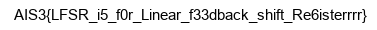

### ReSolveFinaL
- 這題用了[LFSR](https://en.wikipedia.org/wiki/Linear-feedback_shift_register)的架構
- 首先 先把flag.png讀進來用base64 encode過後再轉成binary 並且每個char的bin都有padding成8bit
- 之後 foreach bit去做LFSR 把結果用hex存到enc.png
```
import base64
from secret import register, taps

def toBin(s):
    ret = []
    if type(s) == type(b''):
        s = "".join(map(chr, s))
    for c in s:
        ret.append(bin(ord(c))[2:].zfill(8))
    return "".join(ret)

class LFSR:
    def __init__(self, register, taps):
        self.register = register
        self.taps = taps

    def next(self):
        ret = self.register[0]
        new = 0
        for i in self.taps:
            new ^= self.register[i]
        self.register.append(new)
        self.register = self.register[1:]
        return ret

with open('flag.png','rb') as f:
    flag = f.read()
    flag = base64.b64encode(flag)
    binary = toBin(flag)

lfsr = LFSR(register,taps)
enc = ''
for b in binary:
    enc += str(int(b) ^ lfsr.next())
    
with open('enc.png', 'w') as f:
    f.write(hex(int(enc,2))[2:])
```
- 這邊用base64基本上明文的範圍就大幅縮小 而且每個char的第一個bit一定是0
- 用的是png 那png的header是固定的 而且經過base64又大幅增加了確定的明文範圍
- 先隨便拿一張png去讀header(我就從WTF那題隨便拿了一張 然後取名叫fake.png)
```
with open('fake.png', 'rb') as file:
    flag = file.read()[:6]
    flag = base64.b64encode(flag)
    binary = toBin(flag)
```
- 然後把enc.png讀進來解回enc_binary
```
with open('enc.png', 'rb') as file:
    enc = file.read()
    enc_binary = bin(int(str(enc, "utf-8"), 16))[2:]
```
- 兩者做xor就可以把前面部分的register解回來
```
register_header = []
for i, j in zip(binary, enc_binary):
    register_header.append(int(i) ^ int(j))

''.join(map(str, register_header))
```
- 之後想說wiki上面LFSR的register都是16bits 所以就用16bits去猜猜看taps好了XD
```
for n in range(2, 16):  # taps element len
     for i in itertools.combinations(list(range(16)), n):
         key = True
         lfsr = LFSR(register_header[:16], list(i))
         for bit in register_header:
             if bit != lfsr.next():
                 key = False
                 break
         if key: print(list(i))
```
- 跑下去還真的跑出一堆taps 拿第一個來試試看好了
```
taps = [2, 3, 5, 11, 12]
lfsr = LFSR(register_header[:16], taps)
dec = "".join([str(int(b) ^ lfsr.next()) for b in enc_binary])
dec_base64 = bytes([int(dec[i:i+8], 2) for i in range(0, len(dec), 8) ])
open("flag.png", "wb").write(base64.b64decode(dec_base64))
```
- 然後就 **`TADA!`** flag.png意外地還原了
- flag: 